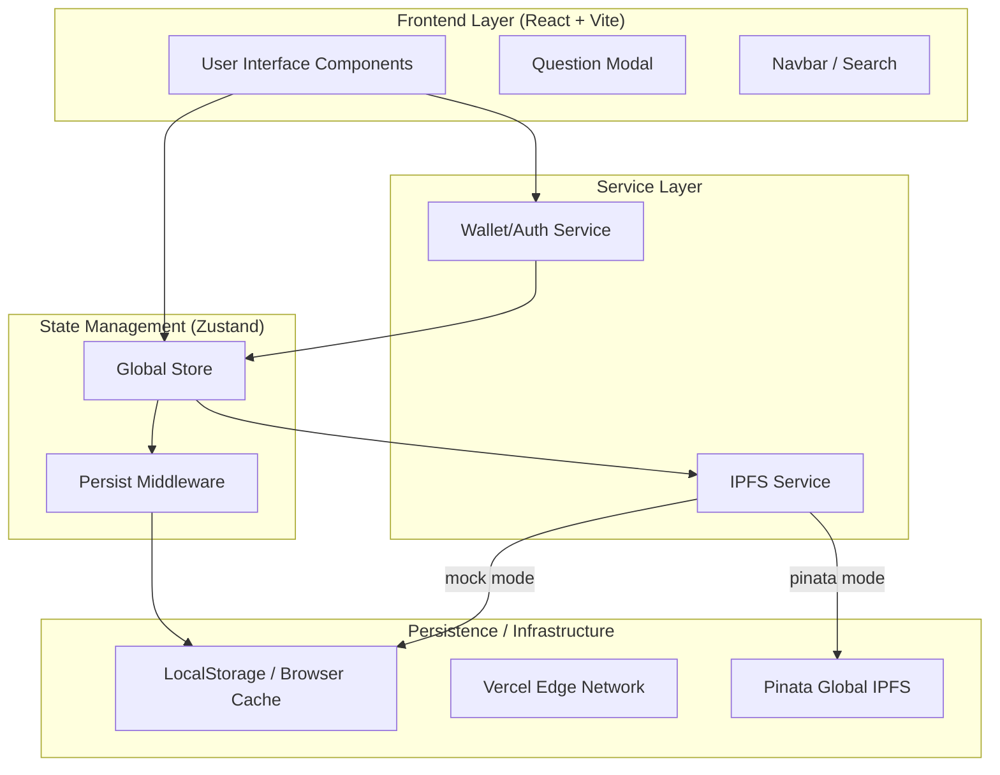
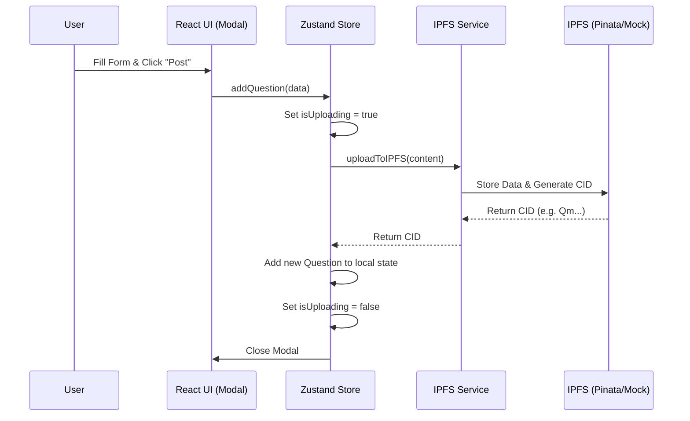
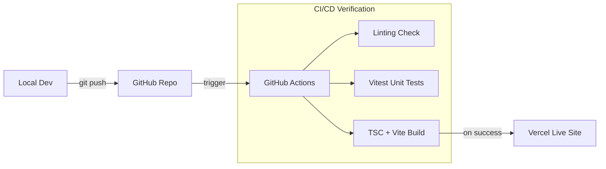

# System Diagram & Layers

This document provides a visual representation of the ChainOverflow architecture, highlighting the separation of concerns and data flow.

## 🏗️ High-Level Architecture

## 🔄 Data Flow: Posting a Question

The following sequence diagram shows the flow of data when a user asks a new question.

## 🚀 DevOps & Deployment Pipeline

How code moves from your computer to the live site.

## 🛠️ Layer Definitions

| Layer             | Responsibility                              | Technology                  |
| ----------------- | ------------------------------------------- | --------------------------- |
| **UI Layer**      | Presentation, User Input, Visual Feedback   | React 19, Vanilla CSS       |
| **State Layer**   | Global state, Async Actions, Search Logic   | Zustand 5                   |
| **Service Layer** | Third-party API abstraction (IPFS, Wallets) | Custom Hooks/Services       |
| **Persistence**   | Long-term data storage                      | LocalStorage, Pinata (IPFS) |
| **Edge Layer**    | Delivery, CDN, Branch Previews              | Vercel                      |
